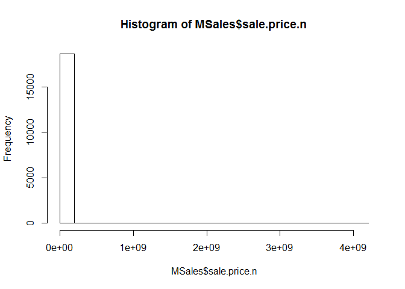
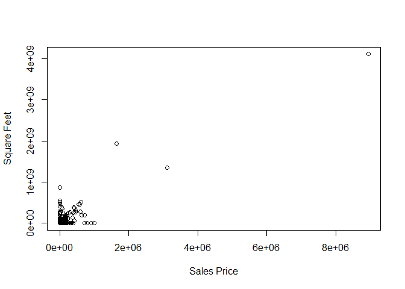
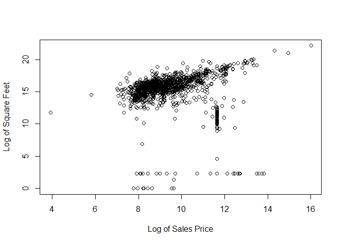

# MSDS 6306_402_GroupHW_Wk3
Anderwald, Frye, Farrar, Vitovsky  
May 25, 2016  


## Introduction
Our team analyzed the the annual sales data of properties sold in Manhattan, NY.  This data "displays yearly sales information of properties sold in New York City," (http://www1.nyc.gov/site/finance/taxes/property-annualized-sales-update.page).

##Required Packages
The packages **plyr** and **gdata** are required to run commands we performed in organizing the data.  Additionally, we used **knitr** to generate reports from this file, and  **repmis** for additional options for reproduceable research.


##Data File
One can download the file for themselves from the URL https://www1.nyc.gov/assets/finance/downloads/pdf/rolling_sales/neighborhood_sales/manhattan_sales_prices.xls.  We downloaded the most recent data as of the date of our report in May 2016.  After converting the Excel file to a CSV plain text document, we began checking out the data so that we could organize it for analysis. Of course, one can use the gdata package to read the .xls file into R as well. Please change the eval and include commands to "FALSE" or "TRUE" depending on whether you are using Windows or Mac.

```r
MSales <- read.xls(xls = "http://www1.nyc.gov/assets/finance/downloads/pdf/rolling_sales/rollingsales_manhattan.xls", skip=4, header=TRUE)
```


```r
head(MSales)
```

```
##   BOROUGH              NEIGHBORHOOD
## 1       1 ALPHABET CITY            
## 2       1 ALPHABET CITY            
## 3       1 ALPHABET CITY            
## 4       1 ALPHABET CITY            
## 5       1 ALPHABET CITY            
## 6       1 ALPHABET CITY            
##                        BUILDING.CLASS.CATEGORY TAX.CLASS.AT.PRESENT BLOCK
## 1 03  THREE FAMILY DWELLINGS                                      1   376
## 2 03  THREE FAMILY DWELLINGS                                      1   377
## 3 04  TAX CLASS 1 CONDOS                                         1C   399
## 4 07  RENTALS - WALKUP APARTMENTS                                2B   373
## 5 07  RENTALS - WALKUP APARTMENTS                                2B   373
## 6 07  RENTALS - WALKUP APARTMENTS                                 2   377
##    LOT EASE.MENT BUILDING.CLASS.AT.PRESENT
## 1   24        NA                        C0
## 2   66        NA                        C0
## 3 1101        NA                        R6
## 4   16        NA                        C1
## 5   17        NA                        C1
## 6    2        NA                        C7
##                                     ADDRESS APARTMENT.NUMBER ZIP.CODE
## 1 264 EAST 7TH STREET                                           10009
## 2 243 EAST 7TH   STREET                                         10009
## 3 238 EAST 4TH   STREET                         -               10009
## 4 326 EAST 4TH   STREET                                         10009
## 5 328 EAST 4TH   STREET                                         10009
## 6 112 AVENUE C                                                  10009
##   RESIDENTIAL.UNITS COMMERCIAL.UNITS TOTAL.UNITS LAND.SQUARE.FEET
## 1                 3                0           3             2059
## 2                 3                0           3             2381
## 3                 1                0           1                0
## 4                10                0          10             2204
## 5                10                0          10             2204
## 6                22                3          25             4510
##   GROSS.SQUARE.FEET YEAR.BUILT TAX.CLASS.AT.TIME.OF.SALE
## 1              3696       1900                         1
## 2              3084       1899                         1
## 3                 0       1955                         1
## 4              8625       1899                         2
## 5              8625       1900                         2
## 6             19830       1900                         2
##   BUILDING.CLASS.AT.TIME.OF.SALE   SALE.PRICE  SALE.DATE
## 1                             C0  $ 3,775,000 2015-10-22
## 2                             C0  $ 2,900,000 2015-06-24
## 3                             R6  $ 6,995,000 2015-06-15
## 4                             C1 $ 20,000,000 2015-11-17
## 5                             C1          $ 0 2015-11-17
## 6                             C7 $ 16,700,000 2015-09-10
```

```r
summary(MSales)
```

```
##     BOROUGH                     NEIGHBORHOOD  
##  Min.   :1   MIDTOWN WEST             : 4728  
##  1st Qu.:1   UPPER EAST SIDE (59-79)  : 2180  
##  Median :1   UPPER EAST SIDE (79-96)  : 1705  
##  Mean   :1   UPPER WEST SIDE (59-79)  : 1657  
##  3rd Qu.:1   MIDTOWN EAST             : 1418  
##  Max.   :1   UPPER WEST SIDE (79-96)  :  970  
##              (Other)                  :10754  
##                                  BUILDING.CLASS.CATEGORY
##  13  CONDOS - ELEVATOR APARTMENTS            :7641      
##  10  COOPS - ELEVATOR APARTMENTS             :6414      
##  45  CONDO HOTELS                            :2735      
##  17  CONDO COOPS                             :1219      
##  26  OTHER HOTELS                            :1203      
##  07  RENTALS - WALKUP APARTMENTS             : 867      
##  (Other)                                     :3333      
##  TAX.CLASS.AT.PRESENT     BLOCK           LOT         EASE.MENT     
##  2      :16531        Min.   :   7   Min.   :   1.0   Mode:logical  
##  4      : 5342        1st Qu.: 858   1st Qu.:  37.0   NA's:23412    
##  2C     :  650        Median :1047   Median :1010.0                 
##  1      :  361        Mean   :1107   Mean   : 803.2                 
##  2B     :  305        3rd Qu.:1409   3rd Qu.:1302.0                 
##  2A     :  203        Max.   :2250   Max.   :9117.0                 
##  (Other):   20                                                      
##  BUILDING.CLASS.AT.PRESENT
##  R4     :7640             
##  D4     :6169             
##  RH     :2735             
##  R9     :1219             
##  H3     :1192             
##  C6     : 781             
##  (Other):3676             
##                                       ADDRESS          APARTMENT.NUMBER
##  1335 AVENUE OF THE AMERIC                : 2013               :11771  
##  102 WEST 57TH STREET                     : 1096   HU2         : 1542  
##  1335 AVENUE OF THE AMER                  :  416   TIMES       :  893  
##  551 MAIN STREET, RES                     :  231   5A          :   87  
##  11 MADISON AVENUE                        :  215   5B          :   83  
##  50 RIVERSIDE BOULEVARD                   :  192   3A          :   77  
##  (Other)                                  :19249   (Other)     : 8959  
##     ZIP.CODE     RESIDENTIAL.UNITS COMMERCIAL.UNITS    TOTAL.UNITS      
##  Min.   :    0   Min.   :   0.00   Min.   :  0.0000   Min.   :   0.000  
##  1st Qu.:10016   1st Qu.:   0.00   1st Qu.:  0.0000   1st Qu.:   0.000  
##  Median :10019   Median :   0.00   Median :  0.0000   Median :   1.000  
##  Mean   :10030   Mean   :   2.29   Mean   :  0.3305   Mean   :   2.768  
##  3rd Qu.:10028   3rd Qu.:   1.00   3rd Qu.:  0.0000   3rd Qu.:   1.000  
##  Max.   :10463   Max.   :8759.00   Max.   :211.0000   Max.   :8805.000  
##                                                                         
##  LAND.SQUARE.FEET  GROSS.SQUARE.FEET   YEAR.BUILT  
##  Min.   :      0   Min.   :      0   Min.   :   0  
##  1st Qu.:      0   1st Qu.:      0   1st Qu.:1920  
##  Median :      0   Median :      0   Median :1958  
##  Mean   :   1048   Mean   :   9066   Mean   :1763  
##  3rd Qu.:      0   3rd Qu.:      0   3rd Qu.:1979  
##  Max.   :2675000   Max.   :8942176   Max.   :2015  
##                                                    
##  TAX.CLASS.AT.TIME.OF.SALE BUILDING.CLASS.AT.TIME.OF.SALE
##  Min.   :1.00              R4     :7641                  
##  1st Qu.:2.00              D4     :6169                  
##  Median :2.00              RH     :2735                  
##  Mean   :2.44              R9     :1219                  
##  3rd Qu.:2.00              H3     :1193                  
##  Max.   :4.00              C6     : 781                  
##                            (Other):3674                  
##        SALE.PRICE         SALE.DATE    
##  $ 0        : 4801   2015-07-07:  369  
##  $ 45,000   :  217   2015-10-28:  353  
##  $ 10       :   97   2015-11-23:  346  
##  $ 850,000  :   84   2015-08-18:  332  
##  $ 650,000  :   80   2015-12-21:  310  
##  $ 1,500,000:   76   2015-08-11:  272  
##  (Other)    :18057   (Other)   :21430
```

```r
str(MSales)
```

```
## 'data.frame':	23412 obs. of  21 variables:
##  $ BOROUGH                       : int  1 1 1 1 1 1 1 1 1 1 ...
##  $ NEIGHBORHOOD                  : Factor w/ 39 levels "ALPHABET CITY            ",..: 1 1 1 1 1 1 1 1 1 1 ...
##  $ BUILDING.CLASS.CATEGORY       : Factor w/ 42 levels "01  ONE FAMILY DWELLINGS                    ",..: 3 3 4 5 5 5 5 5 5 5 ...
##  $ TAX.CLASS.AT.PRESENT          : Factor w/ 8 levels "1","1A","1C",..: 1 1 3 6 6 4 4 4 4 4 ...
##  $ BLOCK                         : int  376 377 399 373 373 377 377 385 387 387 ...
##  $ LOT                           : int  24 66 1101 16 17 2 2 2 119 119 ...
##  $ EASE.MENT                     : logi  NA NA NA NA NA NA ...
##  $ BUILDING.CLASS.AT.PRESENT     : Factor w/ 123 levels "A1","A4","A5",..: 10 10 92 11 11 17 17 17 17 17 ...
##  $ ADDRESS                       : Factor w/ 12053 levels "1 5TH AVENUE, 11F/G                      ",..: 5794 5235 5071 7252 7266 738 738 4096 10862 10862 ...
##  $ APARTMENT.NUMBER              : Factor w/ 2758 levels "-           ",..: 2 2 1 2 2 2 2 2 2 2 ...
##  $ ZIP.CODE                      : int  10009 10009 10009 10009 10009 10009 10009 10009 10009 10009 ...
##  $ RESIDENTIAL.UNITS             : int  3 3 1 10 10 22 22 12 22 22 ...
##  $ COMMERCIAL.UNITS              : int  0 0 0 0 0 3 3 4 2 2 ...
##  $ TOTAL.UNITS                   : int  3 3 1 10 10 25 25 16 24 24 ...
##  $ LAND.SQUARE.FEET              : int  2059 2381 0 2204 2204 4510 4510 4186 3445 3445 ...
##  $ GROSS.SQUARE.FEET             : int  3696 3084 0 8625 8625 19830 19830 10588 13546 13546 ...
##  $ YEAR.BUILT                    : int  1900 1899 1955 1899 1900 1900 1900 1900 1920 1920 ...
##  $ TAX.CLASS.AT.TIME.OF.SALE     : int  1 1 1 2 2 2 2 2 2 2 ...
##  $ BUILDING.CLASS.AT.TIME.OF.SALE: Factor w/ 123 levels "A1","A4","A5",..: 10 10 92 11 11 17 17 17 17 17 ...
##  $ SALE.PRICE                    : Factor w/ 6619 levels "$ 0","$ 1","$ 1,000",..: 2989 2312 5042 2357 1 1579 1 1 1160 1 ...
##  $ SALE.DATE                     : Factor w/ 339 levels "2015-05-01","2015-05-02",..: 172 53 45 198 198 130 130 300 220 220 ...
```

We see that the data is made up of 21 variables, and includes 23,412 observations. As we read through the variable names and types, we see areas that we would like to clean up:

  *Make sure the fields we need are read as the appropriate type (ex., Sales.Price   was read as a factor when it should be numeric).
  
  *Remove dollar signs and commas so that calculations can be adequately    
  performed.
  
  *Run histograms to review the data and recognize strange/noticeable behaviors.
  

```r
#Change SALES.PRICE to numeric and see if there are NAs
MSales$SALE.PRICE.N <- as.numeric(gsub("[^[:digit:]]","", MSales$SALE.PRICE))
count(is.na(MSales$SALE.PRICE.N))
```

```
##       x  freq
## 1 FALSE 23412
```


```r
#Change all variable to lower case for ease
names(MSales) <- tolower(names(MSales))
```


```r
#Change sale.date to Date format in R
MSales$sale.date <- as.Date(MSales$sale.date, "%m/%d/%Y")
MSales$year.built <- as.numeric(as.character(MSales$year.built))
```


```r
hist(MSales$sale.price.n) 
```

<!-- -->

```r
hist(as.numeric(MSales$sale.price[MSales$sale.price.n>0]), main = "Histogram of Sales Prices", xlab = "Sales Price", col = "red")
```

<!-- -->

```r
hist(MSales$gross.square.feet[MSales$gross.square.feet==0], main = "Histogram of Square Feet", xlab = "Square Feet", col = "red")
```

<!-- -->

After viewing histograms of the data, we see that we should transfor the data via the log command.  


```r
MSales.sale <- MSales[MSales$sale.price.n!=0,]
plot(MSales.sale$gross.square.feet,MSales.sale$sale.price.n, ylab = "Square Feet", xlab = "Sales Price")
```

<!-- -->

```r
plot(log(MSales.sale$gross.square.feet),log(MSales.sale$sale.price.n), ylab = "Log of Square Feet", xlab = "Log of Sales Price")
```

<!-- -->

## Outliers 
We see that there are many instances where sales price was $0, which doesn't seem likely.  What is more likely is that the sales price wasn't available or not gathered.  For this reason, we are comfortable removing these as outliers.


```r
MSales.sale$outliers <- (log(MSales.sale$sale.price.n) <=5) + 0
MSales.sale <- MSales.sale[which(MSales.sale$outliers==0),]
plot(log(MSales.sale$gross.square.feet),log(MSales.sale$sale.price.n),main = "Home Sales by Square Footage", ylab = "Sales Price", xlab = "Gross Square Feet")
```

<!-- -->
