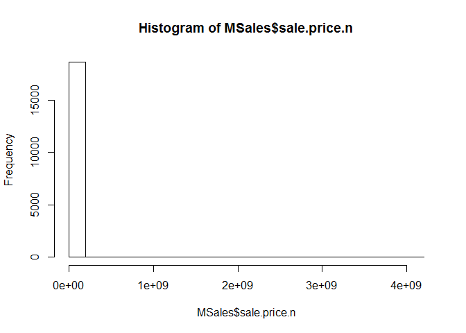
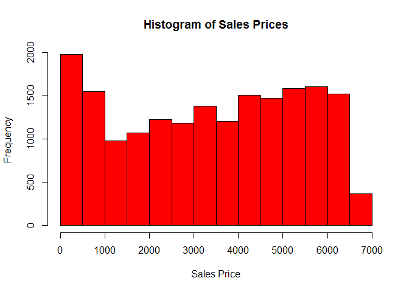
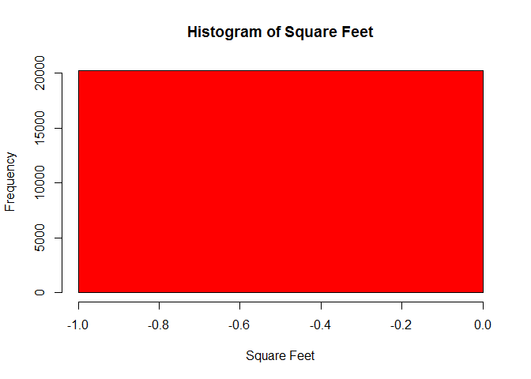
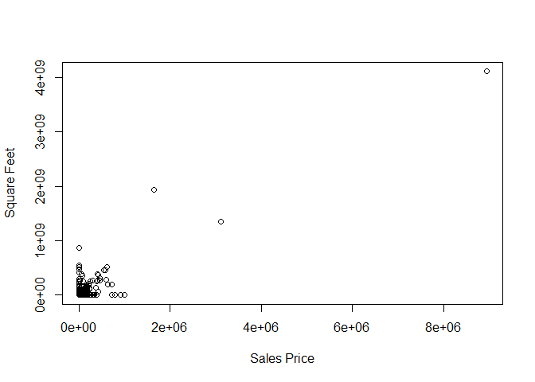
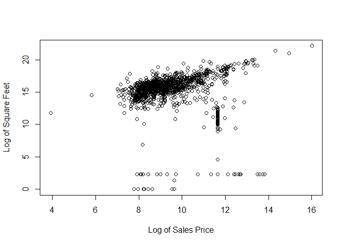
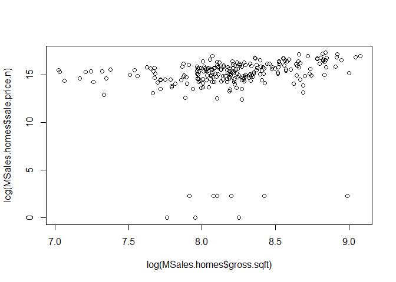
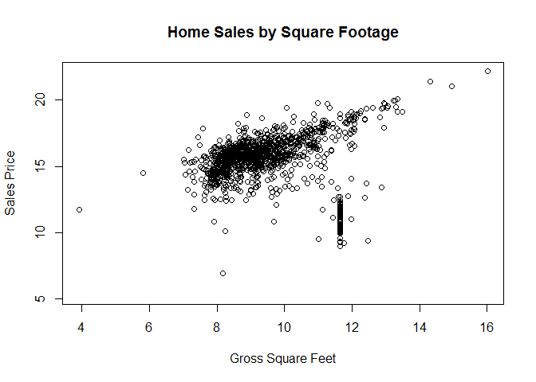
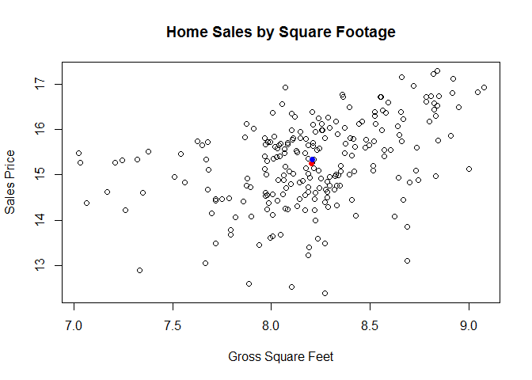

# RollingSales_Manhattan_Paper
Scott Anderwald; Alex Frye; Christopher Farrar; Lindsay Vitovsky  


#Executive Summary
This project provides an analysis of the property values for the Borough of Manhattan.  This analysis was only provided for the Borough of the Manhattan area no other areas where included in the analysis. In particular, the question of the gross footage versus property values. 

The analysis began with the importing and cleaning of the data.  Since certain computations produce incompatible characters that alter the results of the analysis cleaning and removing these characters made it possible for a more precise analysis to be performed.  
The project provided a means to teach file structure and simple analysis on data sets.  Since the scope of project only required the basic setup of file structure no further analysis was performed beyond the gross footage versus property values. 

#Introduction
A team consisting of Alex Frye, Christopher Farrar, Lindsay Vitovsky, and Scott Anderwald was tasked to setup and analyze data from the City of New York Department of Housing.  For the project a file structure system was setup on GitHub where team members could collaborate on the project.  After setting up the project folder the data set from the depository was downloaded.  Before the analysis could be performed team members began the task of preliminary data investigation and cleaning.
	While many different programs on the market is available for data analysis the team utilized the software called “R”.  R is an open source program with a large development and support community.  This large support base allows user to search out to the community for help when the need arises.  Like many other programs R will produce a better output when the data has been cleaned removing the NA’s.  
	To ensure a reliable output from the software data during the analysis was cleaned up to remove characters that could potentially alter the results.  Along with the removal and during the analysis the team noticed the data was highly right skewed and would need to be ran using a log rhythmic function.  This function allowed the team to plot the highly skewed data on a histogram.
	While the scope of the project was limited to setting up a project folder on GitHub with the associated subfolders only a preliminary analysis of square footage versus prices was requested.  According to the analysis the larger residential units consisting of 1 family and multi-family homes encompassed the larger amounts of sales. The spread of the data could suggest there is another plausible reason behind the increased sale prices of the residential homes.  While the data spread suggests there could be a variety of housing option for potential buyers for the Manhattan Borough there might still be an issue of cost to the buyers.


#Data Cleanup on Annual Manhattan Housing Sales 

When originally loading data into R for analysis, we identified several inconsistencies with how the data was represented upon initial load. Due to these inconsistencies we have outlined several steps we went through to clean our data types and handling of data outliers where appropriate. The next sections will discuss and walk through the process of cleaning our Manhattan Sales Dataset. The data cleanup file can be found in the data directory of this project.


###Required Packages
The packages **plyr** and **gdata** are required to run commands we performed in organizing the data. 


###Data File
As of the date of this analysis(5/23/2016), we sourced our data from the following URL: https://www1.nyc.gov/assets/finance/downloads/pdf/rolling_sales/neighborhood_sales/manhattan_sales_prices.xls.  

To work with raw data, we converted the XLS file to a CSV file, which can be found in our Analysis folder. 


```r
head(MSales)
```

```
##   BOROUGH              NEIGHBORHOOD
## 1       1 ALPHABET CITY            
## 2       1 ALPHABET CITY            
## 3       1 ALPHABET CITY            
## 4       1 ALPHABET CITY            
## 5       1 ALPHABET CITY            
## 6       1 ALPHABET CITY            
##                        BUILDING.CLASS.CATEGORY TAX.CLASS.AT.PRESENT BLOCK
## 1 03  THREE FAMILY DWELLINGS                                      1   376
## 2 03  THREE FAMILY DWELLINGS                                      1   377
## 3 04  TAX CLASS 1 CONDOS                                         1C   399
## 4 07  RENTALS - WALKUP APARTMENTS                                2B   373
## 5 07  RENTALS - WALKUP APARTMENTS                                2B   373
## 6 07  RENTALS - WALKUP APARTMENTS                                 2   377
##    LOT EASE.MENT BUILDING.CLASS.AT.PRESENT
## 1   24        NA                        C0
## 2   66        NA                        C0
## 3 1101        NA                        R6
## 4   16        NA                        C1
## 5   17        NA                        C1
## 6    2        NA                        C7
##                                     ADDRESS APARTMENT.NUMBER ZIP.CODE
## 1 264 EAST 7TH STREET                                           10009
## 2 243 EAST 7TH   STREET                                         10009
## 3 238 EAST 4TH   STREET                         -               10009
## 4 326 EAST 4TH   STREET                                         10009
## 5 328 EAST 4TH   STREET                                         10009
## 6 112 AVENUE C                                                  10009
##   RESIDENTIAL.UNITS COMMERCIAL.UNITS TOTAL.UNITS LAND.SQUARE.FEET
## 1                 3                0           3             2059
## 2                 3                0           3             2381
## 3                 1                0           1                0
## 4                10                0          10             2204
## 5                10                0          10             2204
## 6                22                3          25             4510
##   GROSS.SQUARE.FEET YEAR.BUILT TAX.CLASS.AT.TIME.OF.SALE
## 1              3696       1900                         1
## 2              3084       1899                         1
## 3                 0       1955                         1
## 4              8625       1899                         2
## 5              8625       1900                         2
## 6             19830       1900                         2
##   BUILDING.CLASS.AT.TIME.OF.SALE    SALE.PRICE  SALE.DATE
## 1                             C0   $3,775,000  10/22/2015
## 2                             C0   $2,900,000   6/24/2015
## 3                             R6   $6,995,000   6/15/2015
## 4                             C1  $20,000,000  11/17/2015
## 5                             C1         $-    11/17/2015
## 6                             C7  $16,700,000   9/10/2015
```

```r
summary(MSales)
```

```
##     BOROUGH                     NEIGHBORHOOD  
##  Min.   :1   MIDTOWN WEST             : 4728  
##  1st Qu.:1   UPPER EAST SIDE (59-79)  : 2180  
##  Median :1   UPPER EAST SIDE (79-96)  : 1705  
##  Mean   :1   UPPER WEST SIDE (59-79)  : 1657  
##  3rd Qu.:1   MIDTOWN EAST             : 1418  
##  Max.   :1   UPPER WEST SIDE (79-96)  :  970  
##              (Other)                  :10754  
##                                  BUILDING.CLASS.CATEGORY
##  13  CONDOS - ELEVATOR APARTMENTS            :7641      
##  10  COOPS - ELEVATOR APARTMENTS             :6414      
##  45  CONDO HOTELS                            :2735      
##  17  CONDO COOPS                             :1219      
##  26  OTHER HOTELS                            :1203      
##  07  RENTALS - WALKUP APARTMENTS             : 867      
##  (Other)                                     :3333      
##  TAX.CLASS.AT.PRESENT     BLOCK           LOT         EASE.MENT     
##  2      :16531        Min.   :   7   Min.   :   1.0   Mode:logical  
##  4      : 5342        1st Qu.: 858   1st Qu.:  37.0   NA's:23412    
##  2C     :  650        Median :1047   Median :1010.0                 
##  1      :  361        Mean   :1107   Mean   : 803.2                 
##  2B     :  305        3rd Qu.:1409   3rd Qu.:1302.0                 
##  2A     :  203        Max.   :2250   Max.   :9117.0                 
##  (Other):   20                                                      
##  BUILDING.CLASS.AT.PRESENT
##  R4     :7640             
##  D4     :6169             
##  RH     :2735             
##  R9     :1219             
##  H3     :1192             
##  C6     : 781             
##  (Other):3676             
##                                       ADDRESS          APARTMENT.NUMBER
##  1335 AVENUE OF THE AMERIC                : 2013               :11771  
##  102 WEST 57TH STREET                     : 1096   HU2         : 1542  
##  1335 AVENUE OF THE AMER                  :  416   TIMES       :  893  
##  551 MAIN STREET, RES                     :  231   5A          :   87  
##  11 MADISON AVENUE                        :  215   5B          :   83  
##  50 RIVERSIDE BOULEVARD                   :  192   3A          :   77  
##  (Other)                                  :19249   (Other)     : 8959  
##     ZIP.CODE     RESIDENTIAL.UNITS COMMERCIAL.UNITS    TOTAL.UNITS      
##  Min.   :    0   Min.   :   0.00   Min.   :  0.0000   Min.   :   0.000  
##  1st Qu.:10016   1st Qu.:   0.00   1st Qu.:  0.0000   1st Qu.:   0.000  
##  Median :10019   Median :   0.00   Median :  0.0000   Median :   1.000  
##  Mean   :10030   Mean   :   2.29   Mean   :  0.3305   Mean   :   2.768  
##  3rd Qu.:10028   3rd Qu.:   1.00   3rd Qu.:  0.0000   3rd Qu.:   1.000  
##  Max.   :10463   Max.   :8759.00   Max.   :211.0000   Max.   :8805.000  
##                                                                         
##  LAND.SQUARE.FEET  GROSS.SQUARE.FEET   YEAR.BUILT  
##  Min.   :      0   Min.   :      0   Min.   :   0  
##  1st Qu.:      0   1st Qu.:      0   1st Qu.:1920  
##  Median :      0   Median :      0   Median :1958  
##  Mean   :   1048   Mean   :   9066   Mean   :1763  
##  3rd Qu.:      0   3rd Qu.:      0   3rd Qu.:1979  
##  Max.   :2675000   Max.   :8942176   Max.   :2015  
##                                                    
##  TAX.CLASS.AT.TIME.OF.SALE BUILDING.CLASS.AT.TIME.OF.SALE
##  Min.   :1.00              R4     :7641                  
##  1st Qu.:2.00              D4     :6169                  
##  Median :2.00              RH     :2735                  
##  Mean   :2.44              R9     :1219                  
##  3rd Qu.:2.00              H3     :1193                  
##  Max.   :4.00              C6     : 781                  
##                            (Other):3674                  
##         SALE.PRICE         SALE.DATE    
##   $-         : 4801   7/7/2015  :  369  
##   $45,000    :  217   10/28/2015:  353  
##   $10        :   97   11/23/2015:  346  
##   $850,000   :   84   8/18/2015 :  332  
##   $650,000   :   80   12/21/2015:  310  
##   $1,500,000 :   76   8/11/2015 :  272  
##  (Other)     :18057   (Other)   :21430
```

```r
str(MSales)
```

```
## 'data.frame':	23412 obs. of  21 variables:
##  $ BOROUGH                       : int  1 1 1 1 1 1 1 1 1 1 ...
##  $ NEIGHBORHOOD                  : Factor w/ 39 levels "ALPHABET CITY            ",..: 1 1 1 1 1 1 1 1 1 1 ...
##  $ BUILDING.CLASS.CATEGORY       : Factor w/ 42 levels "01  ONE FAMILY DWELLINGS                    ",..: 3 3 4 5 5 5 5 5 5 5 ...
##  $ TAX.CLASS.AT.PRESENT          : Factor w/ 8 levels "1","1A","1C",..: 1 1 3 6 6 4 4 4 4 4 ...
##  $ BLOCK                         : int  376 377 399 373 373 377 377 385 387 387 ...
##  $ LOT                           : int  24 66 1101 16 17 2 2 2 119 119 ...
##  $ EASE.MENT                     : logi  NA NA NA NA NA NA ...
##  $ BUILDING.CLASS.AT.PRESENT     : Factor w/ 123 levels "A1","A4","A5",..: 10 10 92 11 11 17 17 17 17 17 ...
##  $ ADDRESS                       : Factor w/ 12053 levels "1 5TH AVENUE, 11F/G                      ",..: 5794 5235 5071 7252 7266 738 738 4096 10862 10862 ...
##  $ APARTMENT.NUMBER              : Factor w/ 2758 levels "-           ",..: 2 2 1 2 2 2 2 2 2 2 ...
##  $ ZIP.CODE                      : int  10009 10009 10009 10009 10009 10009 10009 10009 10009 10009 ...
##  $ RESIDENTIAL.UNITS             : int  3 3 1 10 10 22 22 12 22 22 ...
##  $ COMMERCIAL.UNITS              : int  0 0 0 0 0 3 3 4 2 2 ...
##  $ TOTAL.UNITS                   : int  3 3 1 10 10 25 25 16 24 24 ...
##  $ LAND.SQUARE.FEET              : int  2059 2381 0 2204 2204 4510 4510 4186 3445 3445 ...
##  $ GROSS.SQUARE.FEET             : int  3696 3084 0 8625 8625 19830 19830 10588 13546 13546 ...
##  $ YEAR.BUILT                    : int  1900 1899 1955 1899 1900 1900 1900 1900 1920 1920 ...
##  $ TAX.CLASS.AT.TIME.OF.SALE     : int  1 1 1 2 2 2 2 2 2 2 ...
##  $ BUILDING.CLASS.AT.TIME.OF.SALE: Factor w/ 123 levels "A1","A4","A5",..: 10 10 92 11 11 17 17 17 17 17 ...
##  $ SALE.PRICE                    : Factor w/ 6619 levels " $-   "," $1 ",..: 2989 2312 5042 2357 1 1579 1 1 1160 1 ...
##  $ SALE.DATE                     : Factor w/ 339 levels "1/1/2016","1/11/2016",..: 40 236 227 65 65 311 311 143 115 115 ...
```

We see that the data is made up of 21 variables, and includes 23,412 observations. 

###Data Cleanup

As we read through the variable names and types, we see areas that we would like to clean up:

* Make sure the fields we need are read as the appropriate type (ex., Sales.Price was read as a factor when it should be numeric).
* Remove dollar signs and commas so that calculations can be adequately    
  performed.
* Run histograms to review the data and recognize strange/noticeable behaviors.
  

```r
#Change SALES.PRICE to numeric and see if there are NAs
MSales$SALE.PRICE.N <- as.numeric(gsub("[^[:digit:]]","", MSales$SALE.PRICE))
count(is.na(MSales$SALE.PRICE.N))
```

```
##       x  freq
## 1 FALSE 18611
## 2  TRUE  4801
```


```r
MSales$gross.sqft <- as.numeric(gsub("[^[:digit:]]","", MSales$GROSS.SQUARE.FEET))
MSales$land.sqft <- as.numeric(gsub("[^[:digit:]]","", MSales$GROSS.SQUARE.FEET))
```


```r
#Change all variable to lower case for ease
names(MSales) <- tolower(names(MSales))
```


```r
#Change sale.date to Date format in R
MSales$sale.date <- as.Date(MSales$sale.date, "%m/%d/%Y")
MSales$year.built <- as.numeric(as.character(MSales$year.built))
```

###Sales Price Outliers


```r
hist(MSales$sale.price.n) 
```

<!-- -->

```r
hist(as.numeric(MSales$sale.price[MSales$sale.price.n>0]), main = "Histogram of Sales Prices", xlab = "Sales Price", col = "red")
```

<!-- -->

```r
hist(MSales$gross.sqft[MSales$gross.sqft==0], main = "Histogram of Square Feet", xlab = "Square Feet", col = "red")
```

<!-- -->

We see that there are many instances where sales price was $0, which doesn't seem likely.  What is more likely is that the sales price wasn't available or not gathered.  For this reason, we are comfortable removing these outliers.  We then see that the data is more manageable and viewable when we use the log command to tranform the data with the log function.

###Remove Outliers and Transform the Data


```r
MSales.sale <- MSales[MSales$sale.price.n!=0,]
plot(MSales.sale$gross.sqft,MSales.sale$sale.price.n, ylab = "Square Feet", xlab = "Sales Price")
```

<!-- -->

```r
plot(log(MSales.sale$gross.sqft),log(MSales.sale$sale.price.n), ylab = "Log of Square Feet", xlab = "Log of Sales Price")
```

<!-- -->

If we limit the data to 1-, 2-, and 3- family homes...


```r
MSales.homes <- MSales.sale[which(grepl("FAMILY",MSales.sale$building.class.category)),]
dim(MSales.homes)
```

```
## [1] 242  24
```

```r
plot(log(MSales.homes$gross.sqft),log(MSales.homes$sale.price.n))
```

<!-- -->

```r
summary(MSales.homes[which(MSales.homes$sale.price.n<100000),])
```

```
##     borough                     neighborhood
##  Min.   :1   UPPER WEST SIDE (96-116) :3    
##  1st Qu.:1   HARLEM-EAST              :2    
##  Median :1   UPPER EAST SIDE (79-96)  :2    
##  Mean   :1   GREENWICH VILLAGE-WEST   :1    
##  3rd Qu.:1   KIPS BAY                 :1    
##  Max.   :1   MIDTOWN EAST             :1    
##              (Other)                  :1    
##                                  building.class.category
##  03  THREE FAMILY DWELLINGS                  :6         
##  02  TWO FAMILY DWELLINGS                    :3         
##  01  ONE FAMILY DWELLINGS                    :2         
##  04  TAX CLASS 1 CONDOS                      :0         
##  07  RENTALS - WALKUP APARTMENTS             :0         
##  08  RENTALS - ELEVATOR APARTMENTS           :0         
##  (Other)                                     :0         
##  tax.class.at.present     block           lot         ease.ment     
##  1      :11           Min.   : 593   Min.   : 13.00   Mode:logical  
##  1A     : 0           1st Qu.:1236   1st Qu.: 38.00   NA's:11       
##  1C     : 0           Median :1520   Median : 42.00                 
##  2      : 0           Mean   :1474   Mean   : 57.55                 
##  2A     : 0           3rd Qu.:1849   3rd Qu.: 62.00                 
##  2B     : 0           Max.   :1891   Max.   :150.00                 
##  (Other): 0                                                         
##  building.class.at.present                                      address 
##  C0     :6                 333 RIVERSIDE DRIVE                      :3  
##  B1     :2                 118 E 83RD                               :1  
##  A9     :1                 128 EAST 92ND   STREET                   :1  
##  B3     :1                 129 WEST 78TH STREET                     :1  
##  S1     :1                 22 CHRISTOPHER STREET                    :1  
##  A1     :0                 234 EAST 49TH   STREET                   :1  
##  (Other):0                 (Other)                                  :3  
##      apartment.number    zip.code     residential.units commercial.units 
##              :11      Min.   :10003   Min.   :1.000     Min.   :0.00000  
##  -           : 0      1st Qu.:10020   1st Qu.:2.000     1st Qu.:0.00000  
##  (-)         : 0      Median :10025   Median :3.000     Median :0.00000  
##  1           : 0      Mean   :10033   Mean   :2.364     Mean   :0.09091  
##  1-A         : 0      3rd Qu.:10032   3rd Qu.:3.000     3rd Qu.:0.00000  
##  1-Apr       : 0      Max.   :10128   Max.   :3.000     Max.   :1.00000  
##  (Other)     : 0                                                         
##   total.units    land.square.feet gross.square.feet   year.built  
##  Min.   :1.000   Min.   :1235     Min.   :2352      Min.   :1899  
##  1st Qu.:2.000   1st Qu.:1572     1st Qu.:3038      1st Qu.:1900  
##  Median :3.000   Median :1840     Median :3645      Median :1901  
##  Mean   :2.455   Mean   :1876     Mean   :4594      Mean   :1904  
##  3rd Qu.:3.000   3rd Qu.:2292     3rd Qu.:6284      3rd Qu.:1905  
##  Max.   :3.000   Max.   :2554     Max.   :8007      Max.   :1920  
##                                                                   
##  tax.class.at.time.of.sale building.class.at.time.of.sale
##  Min.   :1                 C0     :6                     
##  1st Qu.:1                 B1     :2                     
##  Median :1                 A9     :1                     
##  Mean   :1                 B3     :1                     
##  3rd Qu.:1                 S1     :1                     
##  Max.   :1                 A1     :0                     
##                            (Other):0                     
##         sale.price   sale.date           sale.price.n      gross.sqft  
##   $10        :8    Min.   :2015-05-07   Min.   : 1.000   Min.   :2352  
##   $1         :3    1st Qu.:2015-05-27   1st Qu.: 5.500   1st Qu.:3038  
##   $-         :0    Median :2015-06-11   Median :10.000   Median :3645  
##   $1,000     :0    Mean   :2015-07-13   Mean   : 7.545   Mean   :4594  
##   $1,000,000 :0    3rd Qu.:2015-07-26   3rd Qu.:10.000   3rd Qu.:6284  
##   $1,000,391 :0    Max.   :2015-12-14   Max.   :10.000   Max.   :8007  
##  (Other)     :0                                                        
##    land.sqft   
##  Min.   :2352  
##  1st Qu.:3038  
##  Median :3645  
##  Mean   :4594  
##  3rd Qu.:6284  
##  Max.   :8007  
## 
```
...then we run our plots again, removing the values that do not indicate an actual sale was made.


```r
MSales.homes$outliers <- (log(MSales.homes$sale.price.n) <=5) + 0
MSales.homes <- MSales.homes[which(MSales.homes$outliers==0),]
x <- mean(log(MSales.homes$gross.sqft))
y <- mean(log(MSales.homes$sale.price.n))
x2 <- median(log(MSales.homes$gross.sqft))
y2 <- median(log(MSales.homes$sale.price.n))
plot(log(MSales.homes$gross.sqft),log(MSales.homes$sale.price.n),main = "Home Sales by Square Footage", ylab = "Sales Price", xlab = "Gross Square Feet")
points(x, y, pch = 19, col = "red")
points(x2, y2, pch = 19, col = "blue")
```

<!-- -->


#Data Analysis on the relationship between Sales Price and Square Footage

After cleaning the data, we were able to focus in on our analysis on the plot of Sales price and Square Footage. Below are our findings. The analysis file can be found in the analysis directory of this project (Note: the Analysis file is dependent on environment variables from the Data Cleanup File).


###Analysis of Sales Price by Square Footage
After plotting the square footage by sales price, we see that:

  * the highest sales for 1-, 2-, and 3- family homes were also the largest.
  
  * while the most expensive home were the largest, in general, the data seem spread out enough that there might be another factor that would play into the home price.  We are curious to know if the quarter in which the home was sold, or the zip code, have as much as if not more of a role in the sales price of a home in Manhattan.
  
  * the lowest sale prices did not belong to the smallest homes.  This supports our second point above.
  
  * even though there is a diverse array of data points, the prices seem to be most concentrated in the middle of the graph, the log of square footage falling between 8-8.5, and the log of sales price lying between 15-16.  We added mean (red) and median (blue) points to illustrate this. 
  
  * it seems that one would would have needed a budget of at least $1.5 million in 2015 to begin to be able to afford a 1300 square foot home.
  
  * to buy the average size home, 3,700 square feet, one needs about $3.5 million.
  
  * the median and mean are very close to each other, which gives us beginning indication that the data are normally distributed.
  
In summary, Manahttan is a relatively expensive place to live, but there is enough variability in the data that there is an array of options at different price points for those who have at least $750,000 or so to spend.  While square footage played a role in home price generally, the relationship seems to be additionally impacted by other factors, given that there are still a considerable number of more expensive homes in the lower square footage areas.

<!-- -->

#Conclusion

In analyzing our raw Manhattan Housing Sales data from nyc.gov, it was imperative that we do some data cleanup prior to analyzing anything. Two important parts to data analysis is ensuring your data is gathered consistently and reliably, and ensuring that your data gathered is clean for analysis. It is very easy to compute findings with reliable data, but misrepresent the information through poor assumptions that the data is 100% clean when it arrives. 

With our cleaned data, we have evidence that there is a general positive trend in the data identifying that as square footage of homes increase, so does that of Sales price. Although our findings provide evidence of this conclusion, we feel as though there may be other factors playing into the home price. Future discovery is needed to discover whether sale quarter, zip codes, or other factors may also cause fluctuation in pricing. All findings made on this dataset may only be assessed for the population of Manhattan sales gathered by nyc.gov in the range 2015-05-01 through 2016-04-29. Inferences to housing prices in any other region or time period may not be concluded without further data gathering and investigation.
